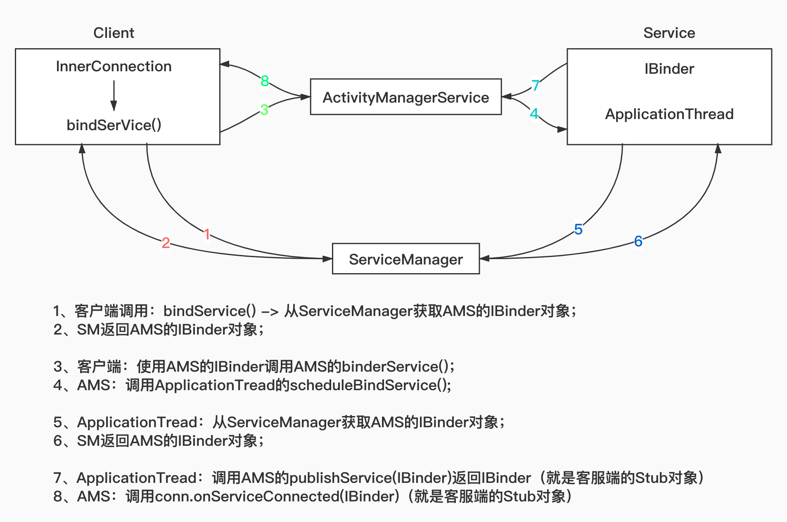
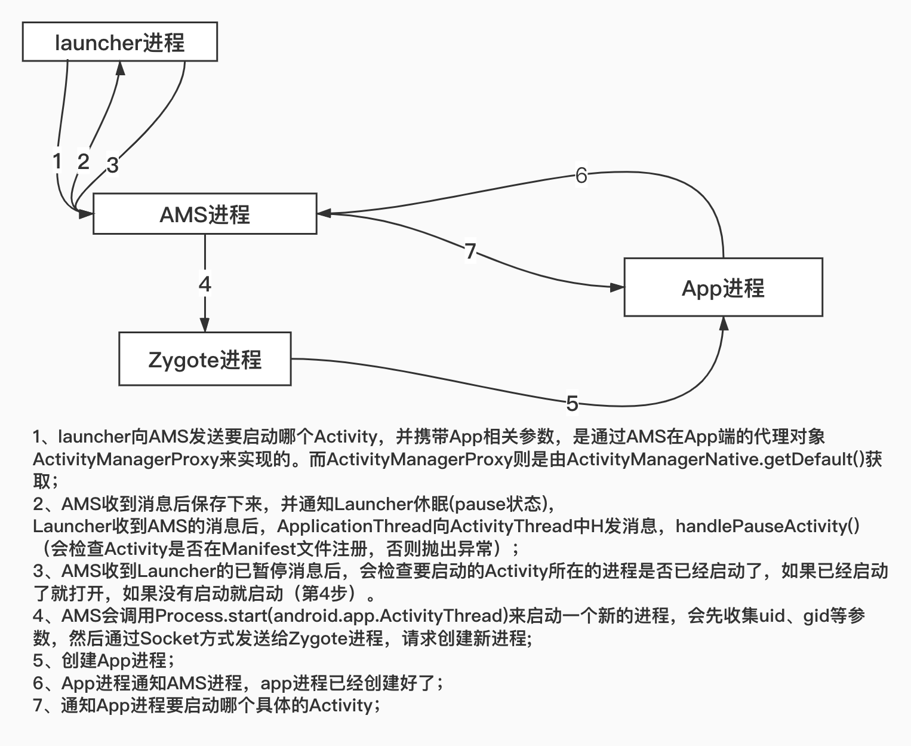

### Binder机制概念：
* 机制：Binder是一种Android中实现跨进程通信（IPC）的方式；
* 组成：是一种物理设备驱动，文件目录：/dev/binder
* 应用层：继承自IBinder接口；

### 为什么选用Binder：
* 性能：Binder数据拷贝只需要一次；
* 安全性：传统的IPC自身没有安全措施，只能依赖上层协议控制，而Binder是根据UID（安装时分配），故进程的UID是鉴别进程身份的重要标志。

### Linux中其他通信方式：
* Socket：是一个通用接口；导致传输效率低，开销大，基于文件和端口，适用于网络传输；
* 管道（Pie）/消息队列：消息队列和管道采用存储-转发方式，即数据先从发送方缓存区拷贝到内核开辟的缓存区中，然后再从内核缓存区拷贝到接收方缓存区；需要2次拷贝；
* 共享内存：实现机制比较复杂；

### Binder是怎么做到一次拷贝的
> MMAP: memory mapping
> 其实我们所讲的工作内存、主内存实际上是一个虚拟内存，真正的只有一个物理内存。而binder的一次拷贝就是指：binder的内存和主内存实际上是映射到同一个物理内存；

### AIDL整体流程：
* --> bindService()
* --> onServiceConnected() （返回IBinder对象）
* --> Stub.asInterface()    接收数据（需要根据是否是同进程，决定返回Stub自身，还是返回的是服务端的Proxy）
* --> queryLocalInterface() 判断是否是同进程
* --> 客户端发起请求：
* --> transact() 远程调用；本地挂起；
* --> 服务端调用onTransact(); 并返回数据；

### onServiceConnected是怎么返回IBinder对象的？
* 客户端调用：bindService() -> 从**ServiceManager**获取AMS的IBinder对象； 第1次binder通信
* SM返回AMS的IBinder对象；                                              第2次binder通信
* 客户端：使用**AMS**的IBinder调用AMS的binderService()；                 第3次binder通信
* AMS：调用ApplicationTread的scheduleBindService();                第4次binder通信
* **ApplicationTread**：从ServiceManager获取AMS的IBinder对象；          第5次binder通信
* SM返回AMS的IBinder对象；                                              第6次binder通信
* ApplicationTread：调用AMS的publishService(IBinder)返回IBinder（就是客服端的Stub对象） 第7次binder通信
* AMS：调用conn.onServiceConnected(IBinder)（就是客服端的Stub对象） 第7次binder通信

### Intent传递数据大小的限制
* Binder通信是无法传递大数据的，一次Binder通信最大可以传输是1MB-8KB（PS：8k是两个pagesize，一个pagesize是申请物理内存的最小单元）。
* 如果传输数据超过这个大小，系统就会报错，因为Binder本身就是为了进程间频繁而灵活的通信所设计的，并不是为了拷贝大数据而使用的。

### Android从点击Launcher图标流程分析

1、Launcher向AMS发送要启动哪个Activity，并携带App相关参数;
   * Instrumentation.execStartActivity()
   * ActivityManagerNative.getDefault().startActivity();
> 而ActivityManagerProxy则是由ActivityManagerNative.getDefault()获取，ActivityManagerNative是AMS的一个内部类；

2、AMS收到消息后保存下来，并通知Launcher休眠(pause状态)；
> 会检查Activity是否在Manifest文件注册，否则抛出异常；

3、Launcher收到AMS的消息后，ApplicationThread向ActivityThread中H发消息，handlePauseActivity()

4、AMS收到Launcher的已暂停消息后，会检查要启动的Activity所在的进程是否已经启动了，如果已经启动了就打开，如果没有启动就启动。

> AMS会调用Process.start(android.app.ActivityThread)来启动一个新的进程，会先收集uid、gid等参数，然后通过**Socket**方式发送给Zygote进程，请求创建新进程;

5、App进程启动好以后会通知AMS进程已经启动好了;
  * AMS调用Process.start方法会创建一个ActivityThread对象，并调用其main函数，
  * 初始化主线程Looper即MainLooper，
  * 并创建Application对象。
  * 然后通过Instrumentation.newApplication通过反射创建Application对象，
  * 并创建ContextImpl通过Application的attach方法与Application进行绑定，
  * 执行Application的onCreate函数进行一些初始化的工作。
  * 完成后会通知AMS进程已经启动好了，并把ActivityThread对象发送给AMS

6、AMS收到app进程启动成功的消息后，通知App进程要启动哪个具体的Activity（在第二步中接收到的启动信息）

7、App进程收到AMS具体要启动的信息后启动Activity并创建Context对象与Activity做关联。
  * app进程的ApplicationThread收到消息后会调用ActiivtyThread的sendMessage方法，给H发送消息，
  * H收到消息后会调用自身的handleMessage方法，
  * 调用ActivityThread的handleLaunchActivity方法，
  * 调用performLaunchActivity方法创建activity和context并将其做关联。
  * 通过Instrumentation.newActiviity方法通过反射创建Actiivty实例

