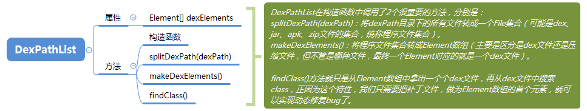

### Android中的类加载器
* BootClassLoader是虚拟机加载系统类需要用到的，
* DexClassLoader可以加载直接或间接包含dex文件的文件，如APK等。
* PathClassLoader是App加载自身dex文件中的类用到的，

> PathClassLoader和DexClassLoader都继承自BaseDexClassLoader，它的一个DexPathList类型的成员变量pathList很重要。  
> DexPathList中有一个Element类型的数组dexElements，这个数组中存放了包含dex文件（对应的是DexFile）的元素。  
> BaseDexClassLoader加载一个类，最后调用的是DexPathList.findClass()的方法进行加载的。

###### DexPathList
* 属性：Element[] dexElements
* makeDexElements：从jar、apk或zip文件中解析出dex文件放入dexElements中；
* findClass：就只是对dexElements数组进行遍历，一旦找到类名与name相同的类时，就直接返回这个class，找不到则返回null

###### 热修复原理
> 只需要让修复好的class打包成一个dex文件，放于Element数组的第一个元素，这样就能保证获取到的class是最新修复好的class了；

> 
