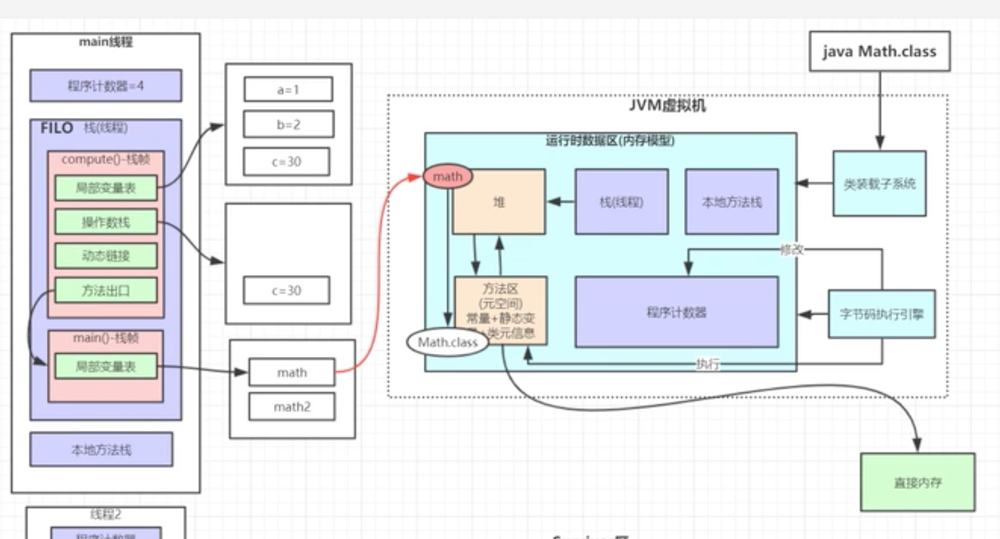

https://www.bilibili.com/video/BV1SZ4y1u71z

### JVM组成
* 类装载子系统
* 字节码执行引擎
> 修改程序计数器的值

* 运行时数据区（内存模型）

### JVM内存模型

#### 栈（虚拟机栈/线程栈）
> 线程独有，JVM会为每个线程从总的栈区域分配一个小的栈，用来存储运行过程的数据；

##### 栈帧
* JVM在调用每个方法的时候，会在栈总创建一个栈帧，栈帧包含**局部变量表**、**操作数栈**、**方法出口**、**动态链接**
* 当方法执行完，这个内存就会出栈；

###### 局部变量表
* 用于存放方法生成的局部变量
* 如果在test()中执行 A a = A(); 那么将在该区域存放a的物理地址，同时**会在堆为a开辟空间**；
* 这样栈和堆就联系起来了；

###### 操作数栈
* 用于临时存放运行时的一些操压栈；
* 比如执行a=1：
  * JVM会首先1压入操作数栈，
  * 然后复制给a，1就会出栈；

###### 方法出口
* 记录方法执行完成以后应该要回到的位置；

#### 程序计数器
> 线程独有，记录JVM当前执行的行号，方便在多线程恢复之后，能够找到之前的运行的位置；

#### 本地方法栈
> 线程独享，就是本地native方法运行时分配的一小块内存；

#### 方法区
> 线程共享，jdk1.8以后叫元空间；

* 主要存储**常量**、**静态变量**、**类元信息**；
> 类元信息：类的元数据信息，类的名称、修饰符、变量、方法；

* 堆和方法区的联系：类的类型指针（class_pointer）将指向方法区响应的类元信息；

#### 堆
* 线程共享 
整个Java虚拟机只有一个堆，所有的线程都访问同一个堆。
* 在虚拟机启动时创建。
* 垃圾回收的主要场所。
* 老年代占2/3，
* 新生代占1/3，
  * 其中eden占4/5，
  * survivor占1/5；

###### Eden
> 当整个区域内存占完以后，会触发minor gc，只会收集eden、survivor；
* 第一次GC的时候，由于Survivor是空的，只会执行Eden的垃圾回收；把存活下来的对象移动到survivor的from，并且分代年龄加1；
* 第二次GC的时候，执行Eden、From的垃圾回收，吧存活的对象移动到To，分代年龄加1；
* 

###### survivor
> 有两个区域，From(s0) 和 To(s1)；总有一个区是空着的；
* s0 -> s1 或者 s1->s0 使用复制算法；

###### 老年代
> 当整个区域内存占完以后，会触发full gc，会收集整个堆和方法区，**比较耗时**；
* 如果一个对象的分代年龄达到15，会被移到该区域；
* 一个对象太大，前面的区域都放不下会被直接放到老年代；
* 如果一个对象超过survivor的50%，也会直接挪到老年代；
* 老年代可能存在的有缓存对象、注解bean对象；

###### 为什么 Survivor 分区不能是 0 个？
> 如果 Survivor 是 0 的话，也就是说新生代只有一个 Eden 分区，每次垃圾回收之后，存活的对象都会进入老生代，这样老生代的内存空间很快就被占满了，从而触发最耗时的 Full GC ，显然这样的收集器的效率是我们完全不能接受的。

###### 为什么 Survivor 分区不能是 1 个？
> 如果 Survivor 分区是 1 个的话，假设我们把两个区域分为 1:1，那么任何时候都有一半的内存空间是闲置的，显然空间利用率太低不是最佳的方案。  
> 但如果设置内存空间的比例是 8:2 ，只是看起来似乎“很好”，假设新生代的内存为 100 MB（ Survivor 大小为 20 MB ），  现在有 70 MB 对象进行垃圾回收之后，剩余活跃的对象为 15 MB 进入 Survivor 区，这个时候新生代可用的内存空间只剩了 5 MB，这样很快又要进行垃圾回收操作，显然这种垃圾回收器最大的问题就在于，需要频繁进行垃圾回收。

###### 为什么 Survivor 分区是 2 个？
> 如果 Survivor 分区有 2 个分区，我们就可以把 Eden、From Survivor、To Survivor 分区内存比例设置为 8:1:1 ，那么任何时候新生代内存的利用率都 90% ，这样空间利用率基本是符合预期的。再者就是虚拟机的大部分对象都符合“朝生夕死”的特性，所以每次新对象的产生都在空间占比比较大的 Eden 区，垃圾回收之后再把存活的对象方法存入 Survivor 区，如果是 Survivor 区存活的对象，那么“年龄”就 +1 ，当年龄增长到 15,对象就升级到老生代。

### 三大垃圾收集算法
> 注意：jvm中，**可达性分析算法**帮我们解决了哪些对象可以回收的问题，**垃圾收集算法则关心怎么回收**。

###### 标记/清除 算法
* 标记清除算法是最基础的收集算法，其他收集算法都是基于这种思想。
* 标记清除算法分为“标记”和“清除”两个阶段：首先标记出需要回收的对象，标记完成之后统一清除对象。
* 它的主要缺点：
  * 标记和清除过程效率不高 。
  * 标记清除之后会产生大量不连续的内存碎片。

###### 复制 算法
* 新生代采用此算法，严格意义上来讲是survivor区采用此算法来实现s0和s1之间的移动；它优化了标记/清除算法的效率和内存碎片问题。
* 主要缺点：内存缩小为原来的一半。

###### 标记/整理 算法
* 【标记】操作和“标记-清除”算法一致，后续操作不只是直接清理对象，而是在清理无用对象完成后让所有存活的对象都向一端移动，并更新引用其对象的指针。
* 主要缺点：在标记-清除的基础上还需进行对象的移动，成本相对较高，好处则是不会产生内存碎片。

### GC Root
> GC root根结点：栈的局部变量、方法区中的变量(静态变量、常量)、本地方法栈(JNI调用)的变量；

### 对象的组成
* 对象头：
  * mark words：自身的哈希值、分代年龄、锁状态信息；
  * class pointer：类型指针，会指向方法区的类元信息；
* 实例信息：instance data，就是具体类的变量值、方法信息；

