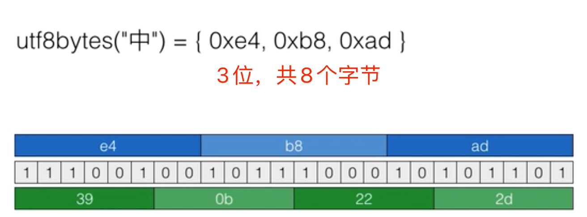

### 编码算法
###### ASCII编码
> 1个字节，不能编码中文；

###### Unicode
> 2个字节（生僻字4个）；如果你写的文本基本上全部是英文的话，用Unicode编码比ASCII编码需要多一倍的存储空间，在存储和传输上就十分不划算。

###### UTF-8
> UTF-8编码有一个额外的好处，就是ASCII编码实际上可以被看成是UTF-8编码的一部分.

###### URL编码：
> 用于网络请求的编码方式

* A～Z、a～z、0～9、- 、_ 、. 、*保持不变；
* 其他字符以%XX表示；例如：< --> %3C、中 --> %E4%B8%AD

###### Base64编码
> 把任意的二进制文件转换为文本；

* 将byte数组按照每6位划分 --> 转换10进制 --> 得到16进制的数字 --> 得到文本；
* 效率会下降，长度增加1/3；

### 摘要算法
> 目的：验证原始数据是否被篡改；

* 长度固定；
* 计算任意长度数据的摘要；
* 相同的文本摘要相同；
* 不同的文本摘要不同；

###### MD5
* 128bits、 16bytes
* 可以用于文件验证，存储口令，登录验证。
* 用于存储口令的时候需要注意什么问题？
  * 需要预防彩虹表攻击：采用一些简单的字符md5加密。
  * 办法是：md5.update(salt+inputPassward) (salt是一些额外的随机数)

###### SHA-1/SHA-256
* 可以看成MD5的加强版，输出由128位变为160/256bits。
* 但是相应的：加解密速度比MD5要慢。

### 对称加密算法
> 加密和解密都使用key，无法确保在传输过程安全传递。
###### DES
> 密钥长度56/64，由于长度不够，被破解的概率较大；

###### AES
> 密钥长度128/192,

### 非对称加密
###### RAS
* 私钥加密，只能公钥解密
* 公钥加密，只能私钥解密
* 私钥一般只有一个，公钥会有多个；
