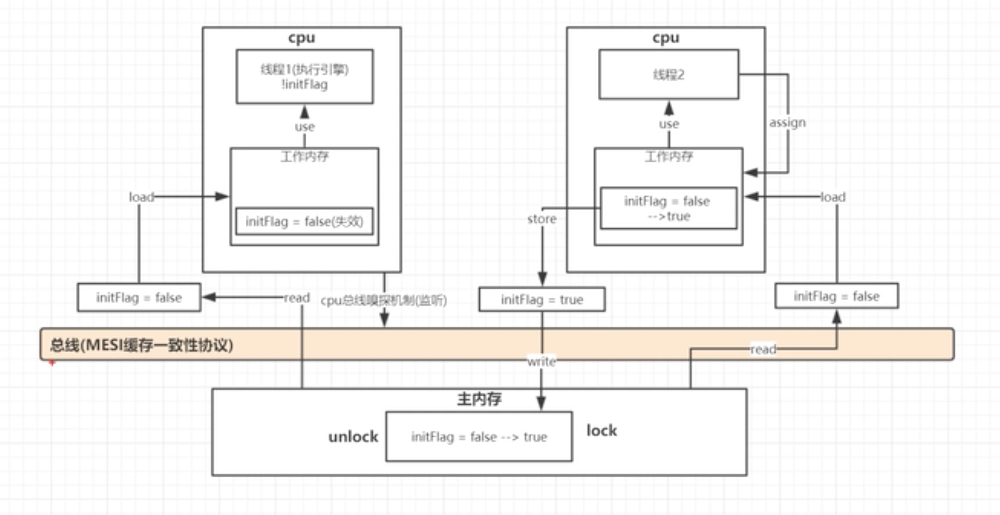

### Java并发编程三大特性：
> 注意和JVM内存模型区分；
##### 原子性
> 所有的操作都应该一步完成，例如：int i = 1;是原子操作，但是i++就不是原子操作；volatile只能保证部分原子性；

##### 可见性
> 每个线程对共享变量的操作都对其他线程可见；volatile可以实现（通过MESI缓存一致性协议实现）；

##### 有序性
> jvm可能会在代码遵循**hanpens-before**和**as-if-serial**原则的情况下，进行字节码的指令重排，以提高效率；使用volatile可以禁止指令重排；

* as-if-serial: 只要不要影响**单线程**程序执行结果的情况下，编译器是可以进行指令重排的，以提高执行效率；
* happens-before：
   * 程序顺序规则：一个线程中的每个操作，happens-before于该线程中的任意后续操作
   * 监视器锁规则：对一个锁的解锁，happens-before于随后对这个锁的加锁
   * volatile变量规则：对一个volatile域的写，happens-before于任意后续对这个volatile域的读
   * 传递性：如果A happens-before B，且B happens-before C，那么A happens-before C
   * start规则：如果线程A执行操作ThreadB.start()（启动线程B），那么A线程的ThreadB.start()操作happens-before于线程B中的任意操作
   * join规则：如果线程A执行操作ThreadB.join()并成功返回，那么线程B中的任意操作happens-before于线程A从ThreadB.join()操作成功返回。

### volatile
* 能保证可见性，有序性；
* volatile只能保证部分原子性；需要借助synchronized锁机制实现；
* 底层通过lock前缀指令，会锁定这块内存区域的缓存，并会写到主内存；
* 会写内存会让其他线程缓存了该内存地址的地址失效，强制重新从主内存中读取；（MESI协议）
* 提供了**内存屏障**，使lock前后不能指令重排；

### 线程的状态
* 新建状态：new Thread();
* 就绪状态：start();
   * 就绪状态只是说你资格运行，调度程序没有挑选到你，你就永远是就绪状态。
   * 调用线程的start()方法，此线程进入就绪状态。
   * 当前线程sleep()方法结束，其他线程join()结束，等待用户输入完毕，某个线程拿到对象锁，这些线程也将进入就绪状态。
   * 当前线程时间片用完了，调用当前线程的yield()方法，当前线程进入就绪状态。
   * 锁池里的线程拿到对象锁后，进入就绪状态。
* 运行状态：run();
* 阻塞状态：blocked；
* 死亡：dead；

### 几个方法比较
* Thread.sleep(long millis)，一定是当前线程调用此方法，当前线程进入TIMED_WAITING状态，但不释放对象锁，millis后线程自动苏醒进入就绪状态。
> 作用：给其它线程执行机会的最佳方式。

* Thread.yield()，一定是当前线程调用此方法，当前线程放弃获取的CPU时间片，但不释放锁资源，由运行状态变为就绪状态，让OS再次选择线程。
* 
> 作用：让相同优先级的线程轮流执行，但并不保证一定会轮流执行。实际中无法保证yield()达到让步目的，因为让步的线程还有可能被线程调度程序再次选中。Thread.yield()不会导致阻塞。该方法与sleep()类似，只是不能由用户指定暂停多长时间。
* t.join()/t.join(long millis)，当前线程里调用其它线程t的join方法，当前线程进入WAITING/TIMED_WAITING状态，当前线程不会释放已经持有的对象锁。线程t执行完毕或者millis时间到，当前线程进入就绪状态。
* obj.wait()，当前线程调用对象的wait()方法，当前线程释放对象锁，进入等待队列。依靠notify()/notifyAll()唤醒或者wait(long timeout) timeout时间到自动唤醒。
* obj.notify()唤醒在此对象监视器上等待的单个线程，选择是任意性的。notifyAll()唤醒在此对象监视器上等待的所有线程。

### volatile、synchronized、Lock的区别
* volatile和synchronized是Java的关键字，而Lock是jdk5之后juc包下的一个接口；
* volatile关键字修饰的变量可以保证可见性、有序性，但是不能保证线程的原子性，而synchronized对原子性、有序性都能保证；
* volatile仅能用于修饰变量，而synchronized可用于修饰方法、代码块等；
* volatile不会造成线程阻塞，synchronized可能会造成线程阻塞；
* synchronized和Lock都能通过加锁来实现线程同步；
* synchronized锁在获取锁的线程执行完了该代码块或者线程执行出现异常后释放锁，而Lock可以主动去释放锁；
* 对于不同场景使用不同的锁，Lock实现的锁种类丰富；
* Lock的性能比synchronized强。